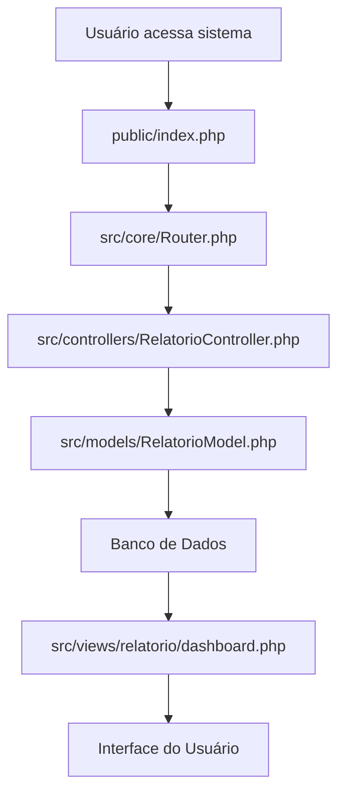
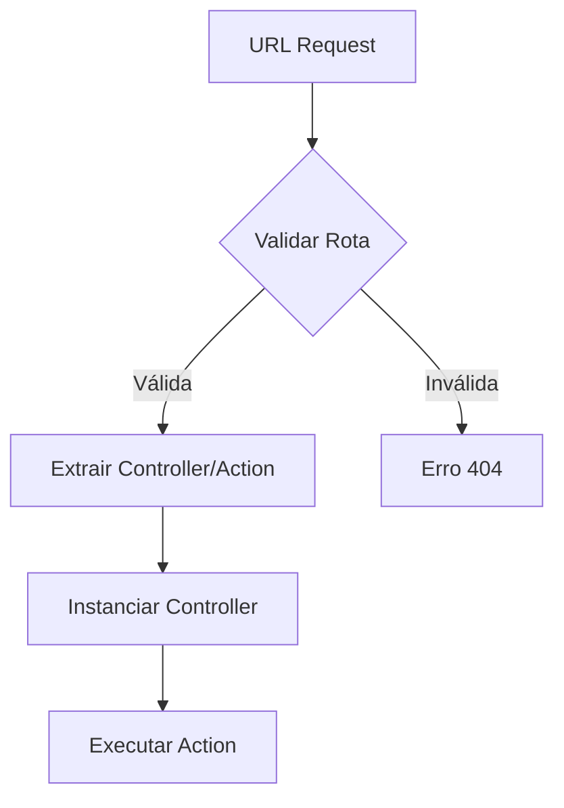
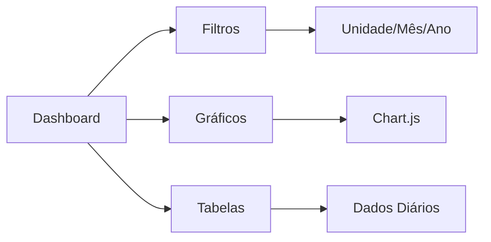
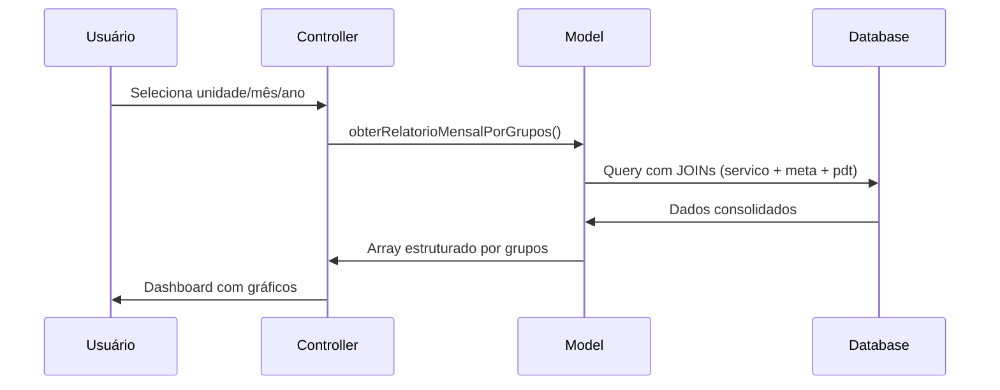
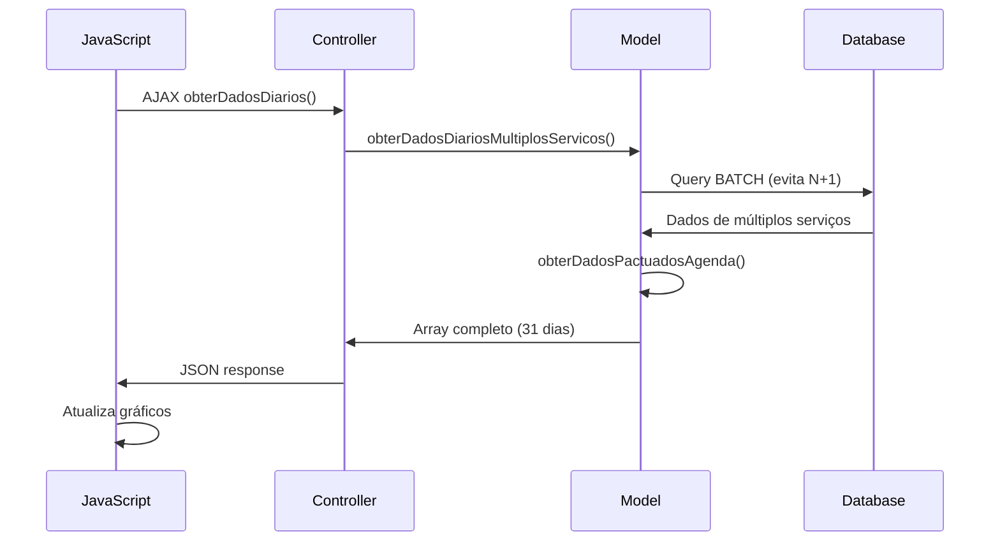
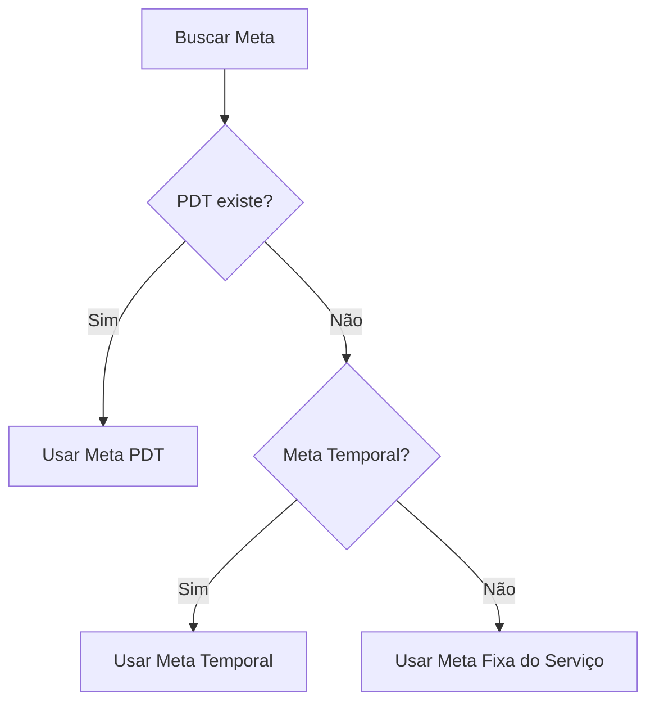

# 🏥 Sistema RTP Hospital - Relatório de Produtividade

Sistema de monitoramento e relatórios de produtividade hospitalar desenvolvido em PHP com arquitetura MVC.

## 📊 Visão Geral
Plataforma para acompanhamento diário da produtividade dos serviços hospitalares da EMSERH, com dashboards interativos e métricas em tempo real.

## 🏗️ Estrutura do Projeto

```
rtp-hospital-report/
├── 📁 public/                 # Entrada pública do sistema
│   ├── index.php             # Bootstrap da aplicação
│   └── assets/               # Recursos estáticos (CSS, JS, images)
├── 📁 src/                   # Código fonte principal
│   ├── config/               # Configurações do sistema
│   ├── core/                 # Núcleo da aplicação
│   ├── controllers/          # Controladores MVC
│   ├── models/               # Modelos de dados
│   ├── views/                # Templates e layouts
│   └── helpers/              # Funções auxiliares
├── 📁 tests/                 # Testes automatizados
└── 📁 logs/                  # Logs do sistema
```

## ⚡ Fluxo Principal da Aplicação



---

## 📂 Detalhamento dos Arquivos

### 🔧 **public/index.php**
**Função:** Bootstrap e ponto de entrada da aplicação

- Carrega configurações
- Inicializa autoloader
- Configura tratamento de erros
- Despacha requisições para o Router

### 🧭 **src/core/Router.php**
**Função:** Sistema de roteamento de URLs

- Analisa URLs recebidas
- Mapeia para controllers/actions
- Gerencia parâmetros de requisição

### 🎮 **src/controllers/RelatorioController.php**
**Função:** Controlador principal dos relatórios
```mermaid
graph TD
    A[Controller] --> B[dashboard()]
    A --> C[obterDadosDiarios()]
    B --> D[RelatorioModel]
    C --> D
    D --> E[Processar Dados]
    E --> F[View/JSON Response]
```
**Métodos principais:**
- `dashboard()` - Tela principal com filtros
- `obterDadosDiarios()` - API para dados diários
- Validação de parâmetros de entrada
- Formatação de resposta JSON/HTML

### 💾 **src/models/RelatorioModel.php**
**Função:** Camada de acesso a dados (otimizada para performance)
```mermaid
graph TD
    A[Model] --> B[obterRelatorioMensalPorGrupos()]
    A --> C[obterDadosDiariosMultiplosServicos()]
    A --> D[obterDadosPactuadosAgenda()]
    B --> E[Query Meta PDT + Temporal]
    C --> F[Query Batch N+1 Fix]
    D --> G[Query Agenda Manhã/Tarde]
    E --> H[Base de Dados]
    F --> H
    G --> H
```
**Métodos otimizados:**
- `obterRelatorioMensalPorGrupos()` - Relatório com meta PDT/temporal
- `obterDadosDiariosMultiplosServicos()` - Carregamento em lote (evita N+1)
- `obterDadosPactuadosAgenda()` - Soma manhã + tarde automaticamente

### 🖼️ **src/views/relatorio/dashboard.php**
**Função:** Interface principal do usuário

- Filtros interativos (unidade, mês, ano)
- Visualização em gráficos (Chart.js)
- Tabelas responsivas com dados diários
- Interface responsiva Bootstrap

### ⚙️ **src/config/**
**Função:** Configurações centralizadas do sistema

#### 📄 **database.php**

- Configuração de conexão PDO
- Credenciais de banco de dados
- Configurações de charset e timezone

#### 📄 **routes.php**

- Mapeamento de URLs para controllers
- Definição de rotas da aplicação

#### 📄 **session.php**

- Configurações de sessão PHP
- Configurações de segurança

---

## 🔄 Fluxo de Dados Principal

### 📈 **Geração de Relatório Mensal**


### 📊 **Carregamento de Dados Diários**


---

## 🚀 Funcionalidades Principais

### ✅ **Implementadas**
- ✅ Dashboard interativo com filtros
- ✅ Visualização por grupos de serviços
- ✅ Gráficos responsivos (Chart.js)
- ✅ Meta PDT + Meta Temporal integradas
- ✅ Soma automática manhã/tarde da agenda
- ✅ Performance otimizada (batch queries)
- ✅ Tratamento robusto de erros

### 🎯 **Características Técnicas**
- **Arquitetura:** MVC Pattern
- **Performance:** Otimizado para grandes volumes
- **Compatibilidade:** PHP 8.0+, MySQL 5.7+
- **Frontend:** Bootstrap + Chart.js
- **Segurança:** Prepared statements, validação de entrada

---

## 🛠️ Instalação e Configuração

### **Pré-requisitos**
- PHP 8.0+
- MySQL 5.7+
- Apache/Nginx
- Composer (para dependencies)

### **Setup Rápido**
1. Clone o repositório
2. Configure `src/config/database.php`
3. Execute via servidor PHP: `php -S localhost:8080 -t public`
4. Acesse: `http://localhost:8080`

---

## 🔧 Arquitetura de Dados

### **Tabelas Principais**
- `servico` - Cadastro de serviços
- `unidade` - Unidades hospitalares
- `rtpdiario` - Dados diários de produtividade
- `agenda` - Dados pactuados (manhã/tarde)
- `pdt` - Metas PDT com período
- `meta` - Metas temporais

### **Fluxo de Meta (Prioridade)**


---

## 📞 Suporte

**EMSERH - Empresa Maranhense de Serviços Hospitalares**
- 🌐 **Site:** [www.emserh.ma.gov.br](https://www.emserh.ma.gov.br)
- 📧 **Email:** suporte.rtp@emserh.ma.gov.br
- 📱 **Emergência:** [telefone-emergencia]

---

<div align="center">

**🏥 Sistema RTP Hospital v2.0.0**  
*Desenvolvido para EMSERH - Todos os direitos reservados © 2025*

[](https://php.net) 
[](https://mysql.com)
[]()

</div>
- **Filtros temporais**: Seleção de mês e ano
- **Indicador de produtividade**: Cálculo automático da produtividade geral
- **Última atualização**: Timestamp da última consulta

### Visualização de Dados
- **Gráficos de barras**: Comparação diária entre pactuado, agendado e realizado
- **Medidores circulares**: Progresso visual da meta atingida
- **Código de cores**: Diferenciação visual por tipo de serviço
- **Controles interativos**: Expandir, reduzir e navegar entre seções

### Segurança
- **Validação de entrada**: Sanitização de todos os inputs
- **Prevenção XSS**: Escape de dados de saída
- **Roteamento seguro**: Validação de rotas e parâmetros
- **Tratamento de erros**: Sistema robusto de error handling

## 💾 Banco de Dados

O sistema utiliza as seguintes tabelas principais:

- **`unidade`**: Cadastro das unidades hospitalares
- **`servico`**: Tipos de serviços por unidade
- **`rtpdiario`**: Registros diários de produtividade
- **`pdt`**: Metas do Plano Diretor de Trabalho

## 🛠️ Requisitos Técnicos

- **PHP**: 7.4 ou superior
- **MySQL**: 5.7 ou superior
- **Apache**: 2.4 ou superior (com mod_rewrite)
- **Extensões PHP**: PDO, PDO_MySQL

## 📦 Instalação

### 1. Clone o repositório
```bash
git clone [url-do-repositorio]
cd rtp-hospital-report
```

### 2. Configure o banco de dados
Edite o arquivo `src/config/database.php`:
```php
$host = 'localhost';
$dbname = 'seu_banco_de_dados';
$username = 'seu_usuario';
$password = 'sua_senha';
```

### 3. Configure o servidor web
- **Apache**: O arquivo `.htaccess` já está configurado
- **Nginx**: Configure o document root para a pasta `public/`

### 4. Importe o banco de dados
```bash
mysql -u usuario -p nome_do_banco < dump-all-u313569922_rtpdiario-202505271211.sql
```

### 5. Configurar permissões
```bash
chmod -R 755 rtp-hospital-report/
```

## 🚀 Como Executar

### 🛠️ **Ambiente de Desenvolvimento**

#### Opção 1: Usando o servidor built-in do PHP
```powershell
# No diretório do projeto
cd c:/projects/rtp_teste/rtp-hospital-report/public
php -S localhost:8000
```
📌 **Acesse**: `http://localhost:8000`

#### Opção 2: Usando XAMPP (Windows)
1. **Instale o XAMPP**: https://www.apachefriends.org/
2. **Copie o projeto** para `C:/xampp/htdocs/rtp-hospital/`
3. **Configure o virtual host** (opcional):
   ```apache
   # Em C:/xampp/apache/conf/extra/httpd-vhosts.conf
   <VirtualHost *:80>
       DocumentRoot "C:/xampp/htdocs/rtp-hospital/public"
       ServerName rtp.local
       <Directory "C:/xampp/htdocs/rtp-hospital/public">
           AllowOverride All
           Require all granted
       </Directory>
   </VirtualHost>
   ```
4. **Adicione ao hosts** (C:/Windows/System32/drivers/etc/hosts):
   ```
   127.0.0.1 rtp.local
   ```
5. **Inicie os serviços**: Apache e MySQL no painel do XAMPP

📌 **Acesse**: `http://rtp.local` ou `http://localhost/rtp-hospital/`

#### Opção 3: Usando WAMP (Windows)
1. **Instale o WAMP**: https://www.wampserver.com/
2. **Coloque o projeto** em `C:/wamp64/www/rtp-hospital/`
3. **Configure virtual host** através do menu do WAMP
4. **Acesse**: `http://rtp-hospital.local`

#### Configuração do Banco - Desenvolvimento
```php
// src/config/database.php - Ambiente de desenvolvimento
$host = 'localhost';
$dbname = 'rtp_desenvolvimento';
$username = 'root';
$password = ''; // Deixe vazio para XAMPP/WAMP
$port = 3306;
```

### 🏭 **Ambiente de Produção**

#### Pré-requisitos de Produção
- Servidor web (Apache/Nginx) configurado
- PHP 7.4+ com extensões necessárias
- MySQL 5.7+ ou MariaDB
- SSL/TLS certificado
- Firewall configurado

#### Deploy em Servidor Linux (Ubuntu/CentOS)

1. **Instalar dependências**:
   ```bash
   # Ubuntu
   sudo apt update
   sudo apt install apache2 php8.1 php8.1-mysql php8.1-mbstring mysql-server
   
   # CentOS
   sudo yum install httpd php php-mysql php-mbstring mariadb-server
   ```

2. **Configurar Virtual Host Apache**:
   ```apache
   # /etc/apache2/sites-available/rtp-hospital.conf
   <VirtualHost *:443>
       ServerName rtp.hospital.com.br
       DocumentRoot /var/www/rtp-hospital/public
       
       SSLEngine on
       SSLCertificateFile /path/to/certificate.crt
       SSLCertificateKeyFile /path/to/private.key
       
       <Directory /var/www/rtp-hospital/public>
           AllowOverride All
           Require all granted
       </Directory>
       
       ErrorLog ${APACHE_LOG_DIR}/rtp-error.log
       CustomLog ${APACHE_LOG_DIR}/rtp-access.log combined
   </VirtualHost>
   ```

3. **Configurar permissões**:
   ```bash
   sudo chown -R www-data:www-data /var/www/rtp-hospital/
   sudo chmod -R 755 /var/www/rtp-hospital/
   sudo chmod -R 777 /var/www/rtp-hospital/logs/ # Se existir pasta de logs
   ```

4. **Configurar banco de dados**:
   ```sql
   CREATE DATABASE rtp_producao CHARACTER SET utf8mb4 COLLATE utf8mb4_unicode_ci;
   CREATE USER 'rtp_user'@'localhost' IDENTIFIED BY 'senha_segura_aqui';
   GRANT ALL PRIVILEGES ON rtp_producao.* TO 'rtp_user'@'localhost';
   FLUSH PRIVILEGES;
   ```

5. **Configuração de produção**:
   ```php
   // src/config/database.php - Produção
   $host = getenv('DB_HOST') ?: 'localhost';
   $dbname = getenv('DB_NAME') ?: 'rtp_producao';
   $username = getenv('DB_USER') ?: 'rtp_user';
   $password = getenv('DB_PASS') ?: 'senha_segura_aqui';
   $port = getenv('DB_PORT') ?: 3306;
   ```

6. **Variáveis de ambiente** (crie arquivo `.env`):
   ```env
   APP_ENV=production
   DB_HOST=localhost
   DB_NAME=rtp_producao
   DB_USER=rtp_user
   DB_PASS=senha_segura_aqui
   DB_PORT=3306
   ```

#### Deploy com Docker (Opcional)

1. **Crie o Dockerfile**:
   ```dockerfile
   FROM php:8.1-apache
   
   # Instalar extensões PHP
   RUN docker-php-ext-install pdo pdo_mysql
   
   # Habilitar mod_rewrite
   RUN a2enmod rewrite
   
   # Copiar código
   COPY . /var/www/html/
   
   # Configurar document root
   ENV APACHE_DOCUMENT_ROOT /var/www/html/public
   RUN sed -ri -e 's!/var/www/html!${APACHE_DOCUMENT_ROOT}!g' /etc/apache2/sites-available/*.conf
   RUN sed -ri -e 's!/var/www/!${APACHE_DOCUMENT_ROOT}!g' /etc/apache2/apache2.conf /etc/apache2/conf-available/*.conf
   
   # Permissões
   RUN chown -R www-data:www-data /var/www/html/
   ```

2. **Docker Compose**:
   ```yaml
   version: '3.8'
   services:
     web:
       build: .
       ports:
         - "80:80"
       environment:
         - DB_HOST=mysql
         - DB_NAME=rtp_hospital
         - DB_USER=root
         - DB_PASS=root123
       depends_on:
         - mysql
     
     mysql:
       image: mysql:8.0
       environment:
         MYSQL_ROOT_PASSWORD: root123
         MYSQL_DATABASE: rtp_hospital
       volumes:
         - mysql_data:/var/lib/mysql
   
   volumes:
     mysql_data:
   ```

3. **Executar**:
   ```bash
   docker-compose up -d
   ```

#### Configurações de Segurança - Produção

1. **PHP.ini ajustado**:
   ```ini
   display_errors = Off
   log_errors = On
   error_log = /var/log/php/error.log
   expose_php = Off
   session.cookie_httponly = 1
   session.cookie_secure = 1
   session.use_strict_mode = 1
   ```

2. **Monitoramento e Logs**:
   ```bash
   # Verificar logs em tempo real
   tail -f /var/log/apache2/rtp-error.log
   tail -f /var/log/mysql/error.log
   ```

3. **Backup automatizado**:
   ```bash
   # Crontab para backup diário   0 2 * * * mysqldump -u rtp_user -p'senha' rtp_producao > /backups/rtp_$(date +\%Y\%m\%d).sql
   ```

## ✅ Verificação de Funcionamento

### 🧪 **Testes Rápidos**

#### Verificar se o sistema está funcionando:
```powershell
# 1. Testar página principal
curl http://localhost:8000/
# Deve retornar HTML da dashboard

# 2. Testar API de dados
curl "http://localhost:8000/api/dados-diarios?unidade_id=1&mes=5&ano=2025"
# Deve retornar JSON com dados

# 3. Verificar arquivos estáticos
curl http://localhost:8000/assets/css/relatorio.css
# Deve retornar CSS

# 4. Testar CSRF protection
curl -X POST http://localhost:8000/relatorio/processar
# Deve retornar erro 403 (CSRF protection ativo)
```

#### Verificar logs em tempo real:
```powershell
# PHP built-in server
php -S localhost:8000 -t public/ | Tee-Object -FilePath "server.log"

# Ou verificar logs do Apache/XAMPP
Get-Content "C:\xampp\apache\logs\error.log" -Wait -Tail 10
```

### 🔍 **Ferramentas de Debug**

#### 1. Verificar status do sistema:
```php
<?php
// Criar arquivo: public/status.php
phpinfo();
echo "<hr>";
echo "PHP Version: " . PHP_VERSION . "<br>";
echo "MySQL Extension: " . (extension_loaded('pdo_mysql') ? 'OK' : 'NOT FOUND') . "<br>";

try {
    $pdo = new PDO("mysql:host=localhost;dbname=rtp_hospital", "root", "");
    echo "Database: CONNECTED<br>";
} catch(Exception $e) {
    echo "Database: ERROR - " . $e->getMessage() . "<br>";
}
?>
```

#### 2. Testar CSRF Protection:
```php
<?php
// Usar os arquivos de teste já criados:
// - test_csrf.php
// - test_csrf_integration.php  
// - final_csrf_test.php

// Executar no navegador:
// http://localhost:8000/test_csrf.php
?>
```

#### 3. Monitor de Performance:
```php
<?php
// Adicionar no início do index.php para monitorar
$start_time = microtime(true);
register_shutdown_function(function() use ($start_time) {
    $execution_time = microtime(true) - $start_time;
    error_log("Execution time: " . round($execution_time * 1000, 2) . "ms");
});
?>
```

### 🎯 **Comandos Úteis**

#### Windows/PowerShell:
```powershell
# Verificar portas em uso
netstat -ano | findstr :80
netstat -ano | findstr :3306

# Verificar se Apache está rodando
Get-Process apache* -ErrorAction SilentlyContinue

# Verificar se MySQL está rodando  
Get-Process mysql* -ErrorAction SilentlyContinue

# Limpar cache DNS (se usando virtual hosts)
ipconfig /flushdns

# Verificar hosts file
Get-Content C:\Windows\System32\drivers\etc\hosts | Select-String "rtp"

# Fazer backup do banco (XAMPP)
& "C:\xampp\mysql\bin\mysqldump.exe" -u root rtp_hospital > backup.sql

# Restaurar banco
& "C:\xampp\mysql\bin\mysql.exe" -u root rtp_hospital < backup.sql
```

#### Linux:
```bash
# Verificar status dos serviços
systemctl status apache2
systemctl status mysql

# Verificar logs em tempo real
tail -f /var/log/apache2/error.log
tail -f /var/log/mysql/error.log

# Verificar permissões
ls -la /var/www/rtp-hospital/

# Testar configuração Apache
apache2ctl configtest

# Verificar virtual hosts
apache2ctl -S

# Backup automatizado
mysqldump -u rtp_user -p rtp_producao | gzip > backup_$(date +%Y%m%d).sql.gz
```

### 📊 **Monitoramento de Produção**

#### Métricas importantes para acompanhar:
```bash
# Uso de CPU e memória
htop

# Espaço em disco
df -h

# Conexões MySQL
mysql -e "SHOW PROCESSLIST;"

# Logs de acesso do Apache
tail -f /var/log/apache2/access.log | grep "POST"

# Verificar certificado SSL
openssl x509 -in /path/to/certificate.crt -text -noout
```

#### Alertas recomendados:
1. **CPU > 80%** por mais de 5 minutos
2. **Memória > 90%** 
3. **Disco > 85%**
4. **Tempo de resposta > 3 segundos**
5. **Erros 500 > 10 por minuto**

## 🔧 Configuração Avançada

### Configuração de Cache (Produção)
```php
// src/config/app.php
define('CACHE_ENABLED', true);
define('CACHE_TTL', 3600); // 1 hora
```

### Configuração de Email (se necessário)
```php
// Para notificações do sistema
$smtp_config = [
    'host' => 'smtp.gmail.com',
    'port' => 587,
    'username' => 'sistema@hospital.com.br',
    'password' => 'senha_app'
];
```

### 🌍 **Configurações por Ambiente**

#### Desenvolvimento Local
```php
// src/config/app.php
define('APP_ENV', 'development');
define('APP_DEBUG', true);
define('APP_URL', 'http://localhost:8000');

// Configurações relaxadas para desenvolvimento
ini_set('display_errors', 1);
error_reporting(E_ALL);
```

#### Staging/Homologação
```php
// src/config/app.php  
define('APP_ENV', 'staging');
define('APP_DEBUG', false);
define('APP_URL', 'https://rtp-staging.hospital.com.br');

// Logs detalhados mas sem exibição de erros
ini_set('display_errors', 0);
ini_set('log_errors', 1);
```

#### Produção
```php
// src/config/app.php
define('APP_ENV', 'production');
define('APP_DEBUG', false);  
define('APP_URL', 'https://rtp.hospital.com.br');

// Configurações de segurança máxima
ini_set('display_errors', 0);
ini_set('expose_php', 0);
```

### 🔐 **Configurações de Segurança Avançadas**

#### Variáveis de Ambiente (.env)
```env
# Ambiente
APP_ENV=production
APP_DEBUG=false
APP_KEY=base64:sua_chave_de_32_caracteres_aqui

# Banco de dados
DB_CONNECTION=mysql
DB_HOST=127.0.0.1
DB_PORT=3306
DB_DATABASE=rtp_hospital
DB_USERNAME=rtp_user
DB_PASSWORD=senha_super_segura

# Segurança
SESSION_LIFETIME=120
CSRF_TOKEN_LIFETIME=3600

# Cache
CACHE_DRIVER=file
CACHE_PREFIX=rtp_
```

#### Configuração de HTTPS Forçado
```php
// public/index.php - Adicionar no início
if (!isset($_SERVER['HTTPS']) && $_ENV['APP_ENV'] === 'production') {
    $redirectURL = 'https://' . $_SERVER['HTTP_HOST'] . $_SERVER['REQUEST_URI'];
    header("Location: $redirectURL");
    exit();
}
```

## 📊 API Endpoints

### GET /
- **Descrição**: Dashboard principal
- **Parâmetros**: `unidade`, `mes`, `ano`

### GET /api/dados-diarios
- **Descrição**: Dados diários para gráficos
- **Parâmetros**: `unidade_id`, `servico_id`, `mes`, `ano`
- **Retorno**: JSON com dados formatados

## 🎨 Personalização

### Cores dos Serviços
As cores são geradas automaticamente baseadas no nome do serviço usando a função `determinarCorServico()` em `helpers/relatorio_helpers.php`.

### Metas Diárias
O cálculo de metas diárias considera:
- Dias úteis (segunda a sexta)
- Sábados com meta reduzida (50%)
- Domingos com meta zero

## 🐛 Solução de Problemas

### 🚨 **Problemas de Execução**

#### Sistema não inicia no ambiente de desenvolvimento
**Sintomas**: Página em branco ou erro 500
**Soluções**:
```powershell
# Verificar se PHP está funcionando
php -v

# Testar servidor built-in
cd public
php -S localhost:8000

# Verificar logs de erro
php -l index.php  # Verificar sintaxe
```

#### XAMPP/WAMP não funciona
**Soluções**:
1. **Porta 80 ocupada**:
   ```powershell
   netstat -ano | findstr :80
   # Mude para porta 8080 no XAMPP
   ```
2. **Apache não inicia**:
   - Verifique se Skype/IIS está usando porta 80
   - Desabilite o World Wide Web Publishing Service

#### Erro "Call to undefined function"
**Sintomas**: `Call to undefined function mysql_connect`
**Solução**:
```powershell
# Verificar extensões PHP
php -m | findstr pdo
php -m | findstr mysql

# Habilitar no php.ini
extension=pdo_mysql
```

### 🗄️ **Problemas de Banco de Dados**

#### Erro de conexão com banco
**Sintomas**: `SQLSTATE[HY000] [2002] No connection could be made`
**Soluções**:
1. **Verificar se MySQL está rodando**:
   ```powershell
   # Windows
   net start mysql
   # Ou via XAMPP Control Panel
   ```

2. **Testar conexão**:
   ```php
   <?php
   try {
       $pdo = new PDO("mysql:host=localhost;dbname=test", "root", "");
       echo "Conexão OK!";
   } catch(PDOException $e) {
       echo "Erro: " . $e->getMessage();
   }
   ?>
   ```

3. **Verificar credenciais**:
   ```php
   // src/config/database.php
   $host = 'localhost';      // ✓ Correto
   $host = '127.0.0.1';      // ✓ Alternativa
   $username = 'root';       // ✓ Padrão XAMPP
   $password = '';           // ✓ Padrão XAMPP (vazio)
   ```

#### Banco de dados não existe
```sql
-- Criar banco via phpMyAdmin ou linha de comando
CREATE DATABASE rtp_hospital CHARACTER SET utf8mb4 COLLATE utf8mb4_unicode_ci;
```

### 🌐 **Problemas de Roteamento**

#### Erro 404 nas rotas
**Sintomas**: `/relatorio/dashboard` retorna 404
**Soluções**:
1. **Verificar mod_rewrite (Apache)**:
   ```apache
   # httpd.conf ou apache2.conf
   LoadModule rewrite_module modules/mod_rewrite.so
   
   # Verificar se AllowOverride está habilitado
   <Directory "/var/www/html">
       AllowOverride All
   </Directory>
   ```

2. **Verificar .htaccess**:
   ```apache
   # .htaccess deve estar na raiz do projeto
   RewriteEngine On
   RewriteCond %{REQUEST_FILENAME} !-f
   RewriteCond %{REQUEST_FILENAME} !-d
   RewriteRule ^(.*)$ public/index.php [QSA,L]
   ```

3. **Nginx (se aplicável)**:
   ```nginx
   location / {
       try_files $uri $uri/ /public/index.php?$query_string;
   }
   ```

### 📱 **Problemas de Interface**

#### Gráficos não carregam
**Sintomas**: Área dos gráficos fica em branco
**Soluções**:
1. **Verificar Console do Navegador** (F12):
   ```javascript
   // Erros comuns:
   // "Chart is not defined" - Biblioteca não carregou
   // "Cannot read property" - Dados não chegaram
   ```

2. **Verificar API**:
   ```powershell
   # Testar endpoint diretamente
   curl http://localhost:8000/api/dados-diarios?unidade_id=1
   ```

3. **Verificar CDN**:
   ```html
   <!-- Verificar se Chart.js carrega -->
   <script src="https://cdn.jsdelivr.net/npm/chart.js"></script>
   ```

#### Estilos CSS não aplicam
**Soluções**:
1. **Verificar paths**:
   ```html
   <!-- Caminho correto -->
   <link rel="stylesheet" href="/assets/css/relatorio.css">
   ```

2. **Cache do navegador**:
   ```powershell
   # Forçar reload: Ctrl + F5 (Windows)
   # Ou adicionar versioning no CSS
   ```

### 🔒 **Problemas de Segurança/CSRF**

#### Erro "CSRF token invalid"
**Sintomas**: Formulário retorna erro 403
**Soluções**:
1. **Verificar token no formulário**:
   ```html
   <!-- Deve existir campo hidden -->
   <input type="hidden" name="csrf_token" value="...">
   ```

2. **Verificar JavaScript**:
   ```javascript
   // Verificar se csrf.js está carregado
   console.log(window.getCsrfToken());
   ```

### 🚀 **Problemas de Performance**

#### Sistema lento
**Soluções**:
1. **Verificar queries SQL**:
   ```php
   // Adicionar logs para debug
   error_log("Query executada: " . $sql);
   ```

2. **Verificar memória PHP**:
   ```ini
   ; php.ini
   memory_limit = 256M
   max_execution_time = 60
   ```

### 📋 **Checklist de Verificação Rápida**

#### ✅ **Desenvolvimento**
- [ ] PHP >= 7.4 instalado (`php -v`)
- [ ] MySQL/MariaDB rodando
- [ ] Mod_rewrite habilitado (Apache)
- [ ] Arquivo `.htaccess` presente
- [ ] Credenciais do banco corretas
- [ ] Banco de dados criado e importado

#### ✅ **Produção**
- [ ] HTTPS configurado
- [ ] Permissões de arquivo corretas (755/644)
- [ ] PHP configurado para produção (`display_errors = Off`)
- [ ] Logs habilitados
- [ ] Backup configurado
- [ ] Firewall configurado
- [ ] Monitoramento ativo

### 📞 **Obter Ajuda**

Se os problemas persistirem:
1. **Verifique os logs**:
   ```powershell
   # Apache
   tail -f /var/log/apache2/error.log
   
   # PHP
   tail -f /var/log/php/error.log
   
   # XAMPP Windows
   # Logs em: C:\xampp\apache\logs\error.log
   ```

2. **Modo debug**:
   ```php
   // Adicionar em config/app.php
   ini_set('display_errors', 1);
   ini_set('display_startup_errors', 1);
   error_reporting(E_ALL);
   ```

## 📈 Status de Implementação e Melhorias Futuras

### ✅ **Recursos Já Implementados**
- [x] **Sistema de segurança robusto** - Validação de entrada, XSS e SQL injection protection
- [x] **CSRF Protection completo** - Proteção contra Cross-Site Request Forgery
- [x] **Headers de segurança** - CSP, XSS-Protection, HSTS, etc.
- [x] **Sistema de logs estruturado** - Logging detalhado para debugging e auditoria  
- [x] **Tratamento de erros profissional** - Error handling robusto com páginas customizadas
- [x] **Rate limiting básico** - Proteção contra ataques de força bruta
- [x] **Configuração ambiente-aware** - Configurações diferentes para dev/staging/produção
- [x] **Session security** - Configuração segura de sessões PHP
- [x] **Hardening Apache** - Configurações de segurança no .htaccess
- [x] **Documentação completa** - Guias detalhados de instalação e execução

### 🚀 **Próximas Melhorias (Roadmap)**

#### Curto Prazo (1-2 meses)
- [ ] **Sistema de autenticação e autorização**
  - Login com hash de senhas (bcrypt/Argon2)
  - Controle de acesso baseado em roles (admin, operador, visualizador)
  - Recuperação segura de senha
  
- [ ] **Testes automatizados**
  - PHPUnit para testes unitários
  - Testes de integração para controllers
  - Testes de segurança automatizados
  
- [ ] **Cache de consultas**
  - Redis/Memcached para melhor performance
  - Cache de queries SQL pesadas
  - Cache de assets estáticos

#### Médio Prazo (3-6 meses)  
- [ ] **Exportação de relatórios**
  - PDF com gráficos (usando mPDF/TCPDF)
  - Excel/CSV para análise de dados
  - Agendamento de relatórios automáticos
  
- [ ] **Dashboard analítico avançado**
  - Métricas históricas e tendências
  - Comparações inter-hospitalares
  - Alertas e notificações automáticas
  
- [ ] **API REST completa**
  - Endpoints padronizados (JSON-API)
  - Documentação Swagger/OpenAPI
  - Rate limiting por endpoint
  
- [ ] **Auditoria e compliance**
  - Log de todas as ações dos usuários
  - Relatórios de auditoria
  - Compliance com LGPD

#### Longo Prazo (6+ meses)
- [ ] **Arquitetura escalável**
  - Microserviços para módulos específicos
  - Event sourcing para auditoria completa
  - Message queues para processamento assíncrono
  
- [ ] **Inteligência artificial**
  - Machine Learning para análise preditiva
  - Detecção de anomalias nos dados
  - Sugestões automáticas de otimização
  
- [ ] **Mobile e PWA**
  - Aplicativo mobile nativo
  - Progressive Web App (PWA)
  - Notificações push
  
- [ ] **Integração externa**
  - APIs governamentais (DataSUS, etc.)
  - Sistemas de ERP hospitalares
  - Business Intelligence (BI) tools

### 🔧 **Melhorias Técnicas Contínuas**
- [ ] **Performance**
  - Database query optimization
  - CDN para assets estáticos
  - Lazy loading de componentes
  
- [ ] **DevOps**
  - Docker containers completos
  - CI/CD pipeline (GitHub Actions)
  - Monitoramento com Prometheus/Grafana
  
- [ ] **Qualidade de código**
  - PHP CodeSniffer para padrões
  - PHPStan para análise estática
  - Cobertura de testes > 80%

## 🤝 Contribuição

### Para contribuir com o projeto:

1. **Fork o projeto** no GitHub
2. **Clone** o fork para sua máquina:
   ```bash
   git clone https://github.com/seu-usuario/rtp-hospital-report.git
   ```
3. **Crie uma branch** para sua feature:
   ```bash
   git checkout -b feature/NovaFuncionalidade
   ```
4. **Faça suas alterações** seguindo os padrões do projeto
5. **Execute os testes** (quando disponíveis):
   ```bash
   php test_csrf.php
   ```
6. **Commit suas mudanças**:
   ```bash
   git commit -m 'feat: adiciona nova funcionalidade X'
   ```
7. **Push para sua branch**:
   ```bash
   git push origin feature/NovaFuncionalidade
   ```
8. **Abra um Pull Request** no GitHub

### 📋 **Guidelines de Contribuição**
- Siga os padrões PSR-12 para PHP
- Documente novas funcionalidades
- Mantenha a cobertura de testes
- Faça commits pequenos e descritivos
- Teste em ambiente local antes do PR

## 📝 Licença

Este projeto é **proprietário** da **EMSERH - Empresa Maranhense de Serviços Hospitalares**.

### Termos de Uso:
- ✅ Uso interno pela EMSERH e hospitais conveniados
- ✅ Modificações para adequação aos processos internos  
- ❌ Redistribuição para terceiros sem autorização
- ❌ Uso comercial por outras organizações

**Todos os direitos reservados © 2025 EMSERH**

## 👥 Equipe e Contatos

### 🏥 **EMSERH - Empresa Maranhense de Serviços Hospitalares**
- **Site**: [www.emserh.ma.gov.br](https://www.emserh.ma.gov.br)
- **Endereço**: São Luís - MA, Brasil

### 👨‍💻 **Equipe de Desenvolvimento**
- **Arquiteto de Software**: GitHub Copilot (AI Assistant)
- **Análise de Requisitos**: Equipe EMSERH
- **Segurança**: Implementação de best practices OWASP
- **UX/UI**: Baseado em requisitos funcionais e usabilidade

### 📞 **Suporte Técnico**

#### 🚨 **Suporte de Emergência (24h)**
- **Telefone**: [telefone-emergencia]
- **Email**: emergencia.ti@emserh.ma.gov.br
- **Problemas críticos**: Sistema fora do ar, falhas de segurança

#### 🛠️ **Suporte Geral (Horário Comercial)**
- **Email**: suporte.rtp@emserh.ma.gov.br  
- **Telefone**: [telefone-suporte]
- **Horário**: Segunda a Sexta, 8h às 18h
- **Tempo de resposta**: 4 horas úteis

#### 📋 **Solicitações e Melhorias**
- **Email**: projetos.ti@emserh.ma.gov.br
- **Sistema**: [Portal interno de chamados]
- **Processo**: Abrir chamado com justificativa técnica

### 📈 **Status do Sistema**
- **Monitoramento**: [URL do status page]
- **Métricas**: [Dashboard público de métricas]
- **Manutenções**: Comunicadas com 48h de antecedência

### 🔗 **Links Importantes**
- **Documentação**: [wiki.emserh.ma.gov.br/rtp](wiki.emserh.ma.gov.br/rtp)
- **Treinamentos**: [treinamento.emserh.ma.gov.br](treinamento.emserh.ma.gov.br)
- **FAQ**: [faq.emserh.ma.gov.br/rtp](faq.emserh.ma.gov.br/rtp)

---

<div align="center">

### 🏥 **Sistema RTP Hospital**
**Desenvolvido com ❤️ para a EMSERH**

[](CSRF_IMPLEMENTATION_COMPLETE.md)
[](https://php.net)
[](https://mysql.com)
[](https://apache.org)

**Última atualização da documentação**: 27 de Maio de 2025  
**Versão do sistema**: 1.0.0 (Security Enhanced)

</div>
